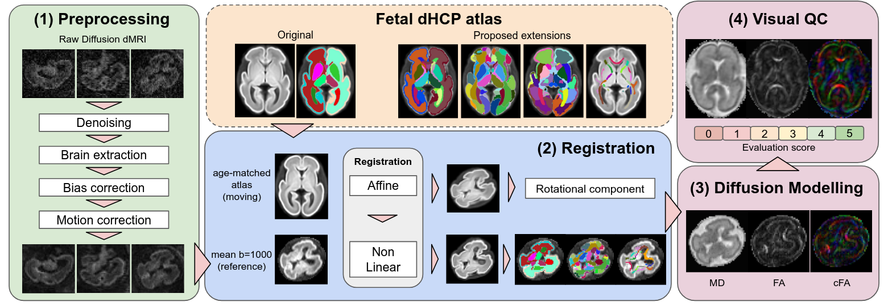

# Automated Pipeline for Processing and Analysis of Clinical Fetal Diffusion MRI

## Pipeline Overview

The pipeline is organized into a series of sequential steps, each handled by a dedicated script. The workflow is as follows:

1.  **Data Preparation (`01_prepare_data.sh`)**: Organizes raw BIDS-like dMRI data into the processing directory structure.
2.  **Preprocessing (`02_preprocessing.sh`)**:
    *   Denoising using Marchenko-Pastur PCA (`dwidenoise`).
    *   Brain extraction using a pre-trained deep learning model ([Fetal-BET](https://github.com/bchimagine/fetal-brain-extraction)).
    *   N4 bias field correction (`N4BiasFieldCorrection`).
    *   Motion and eddy current correction using FSL's `eddy` with slice-to-volume correction. The script robustly tries several outlier detection thresholds to ensure convergence.
3.  **Registration (`03_registration.sh`)**:
    *   Selects the closest age-matched template from the spatiotemporal dHCP fetal diffusion atlas.
    *   Performs affine registration (`flirt`) followed by high-dimensional non-linear registration (`antsRegistration - SyN`) to align the atlas to the subject's native space.
    *   Propagates an extended set of anatomical parcellations to the subject's native space for regional analysis.
4.  **Diffusion Tensor Modeling (`04_tensor_fitting.sh`)**:
    *   Reorients b-vectors according to the registration transform.
    *   Fits the diffusion tensor model and calculates metrics (FA, MD, AD, RD, CFA) in two spaces:
        1.  Subject's native space (for native-space analysis).
        2.  Standard atlas space (for group comparisons and visual QC).
5.  **Quality Control (`99_qc.sh`)**:
    *   Extracts quantitative QC metrics (e.g., motion parameters, outlier slices).
    *   Generates visual reports (lightbox images) of the resulting tensor maps (FA, MD, CFA) for easy inspection.


## Dependencies

This pipeline relies on several external neuroimaging software packages. Please ensure they are installed and available in your system's `PATH`.

*   **FSL**: Used for `eddy`, `flirt`, and various image manipulation tools.
*   **MRtrix3**: Used for denoising, file conversion, and diffusion tensor modeling.
*   **ANTs (Advanced Normalization Tools)**: Used for N4 bias field correction and non-linear registration.
*   **Python 3**: With a configured environment (e.g., Conda) including:
    *   `Nibabel`
    *   `Numpy`
    *   `PyTorch` (for the Fetal-BET brain extraction tool)

*   **[Fetal-BET](https://github.com/bchimagine/fetal-brain-extraction)**: The brain extraction tool and its pre-trained model must be available.

The main execution script (`00_run_pipeline.sh`) is configured to load these dependencies using `module` and `conda`. You may need to adapt these lines to match your system's configuration.

## Data Structure

### Input Data

The pipeline expects input data to be organized in a BIDS-like structure. The main script takes the subject, session, and series ID as arguments.

```
/path/to/rawdata/
└── <SUBJECT_ID>
    └── <SESSION_ID>
        └── <SERIE_ID>
            ├── dwi.nii.gz
            ├── dwi.bval
            ├── dwi.bvec
            └── dwi.json
```
### Output Data

All processed data and intermediate files are saved in a `derivatives` directory, structured as follows:

```
/path/to/derivatives
    └── <SUBJECT_ID>
        └── <SESSION_ID>
            └── <SERIE_ID>
                ├── 01_prepared_data
                ├── 02_preprocessed_data
                ├── 03_registration
                ├── 04_tensor
                └── 99_QC
```
*   `02_preprocessed_data`: Contains the motion-corrected DWI (`dwi_eddycorr.nii.gz`) and brain mask.
*   `03_registration`: Contains registration transforms and warped parcellations .
*   `04_tensor`: Contains the final diffusion metrics in both native and template space.
*   `99_QC`: Contains QC reports, including lightbox images of the tensor maps.

## Atlas and Parcellations

This pipeline relies on the **dHCP spatiotemporal fetal diffusion atlas**. You must download it and provide the correct path in the `03_registration.sh` script (`ATLAS_DIR`).

A key contribution of this work is the use of an extended set of parcellations, which have been pre-registered to the dHCP atlas. These include:
*   CRL2025 Fetal Atlas Parcellations
*   dHCP Neonatal Atlas Parcellations
*   dHCP Neonatal Multi Channel White Matter Parcellations

These extended parcellations are available in the [parcellation.zip](./parcellation.zip) file.

The pipeline automatically warps these parcellations into each subject's native space, enabling detailed region-of-interest (ROI) analysis.

## Usage

1.  **Configuration**:
    *   Clone this repository.
    *   Update the paths in `00_run_pipeline.sh` (e.g., `ROOT_DIR`, `DERIVATIVES_DIR`) to match your environment.
    *   Update the atlas paths in `03_registration.sh` (`ATLAS_DIR`, `PARCELLATIONS_DIR`).
    *   Ensure the dependency loading commands (`module load`, `conda activate`) in `00_run_pipeline.sh` are correct for your system.

2.  **Execution**:
    The pipeline is launched using the main wrapper script `00_run_pipeline.sh`. It requires three arguments: `SUBJECT_ID`, `SESSION_ID`, and `SERIE_ID`.

    ```bash
    bash 00_run_pipeline.sh <SUBJECT_ID> <SESSION_ID> <SERIE_ID>
    ```

    **Example:**
    ```bash
    bash 00_run_pipeline.sh sub-0001 ses-0024 13
    ```

    This command will execute all steps from data preparation to final QC report generation for the specified scan.